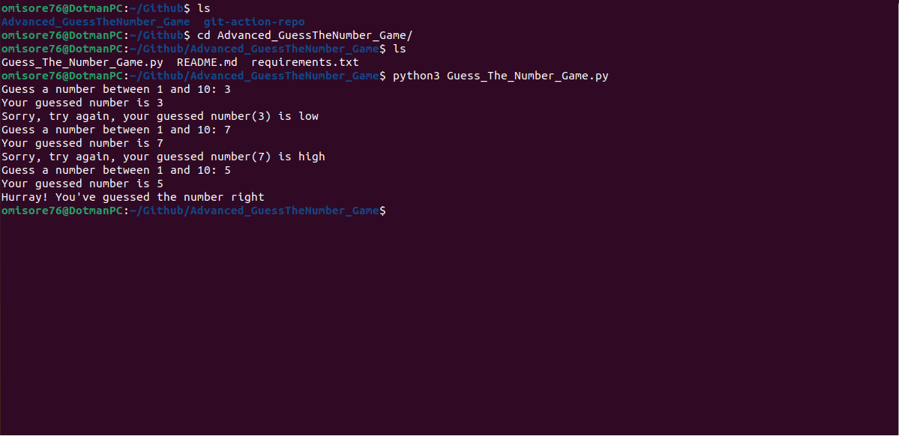

# Advanced_GuessTheNumber_Game

## Introduction

This guessing game is more advanced than your average game. In this case, the computer has a secret number and the user is trying to guess the number. The user only has a limited number of guesses, so they have to be careful! If they guess wrong, they'll lose the game. To make things more challenging, the computer will give the user hints after each guess. The user has to use these hints to try to narrow down the possible numbers. This guessing game is sure to be a challenge for even the most seasoned gamers!



## Prerequisite
- Python3 installed on your local address

## How to Use This Repo

- Fork the repo

- Clone it on your local machine

- While in the project repo on your local machine, create a virtual environment. Run the code below to create a virtual environment
```
	python3 -m venv venv_001
```
- Activate the virtual environment
```
	source venv_001/bin/activate
```
- Install requirements
```
	pip install -r requirements.txt
```
- Run the app
```
	python3 Guess_The_Number_Game.py
```
- Guess the number when prompted

- Finally, deactivate the virtual environment once done 
```
deactivate
```
## Tips

Feel free to edit the code to suit your needs!
